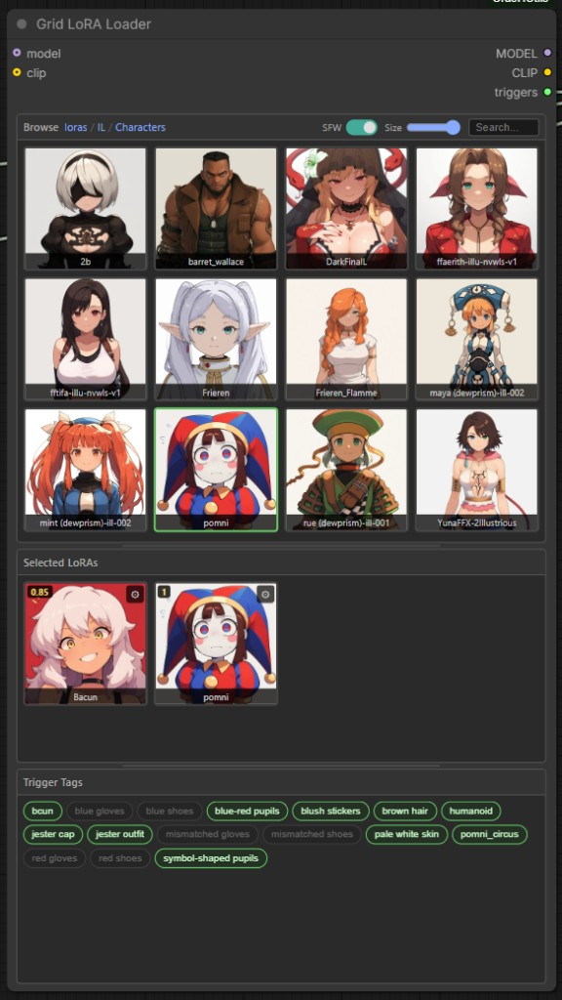
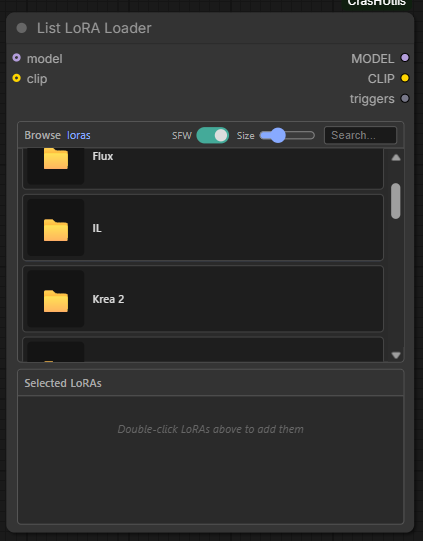
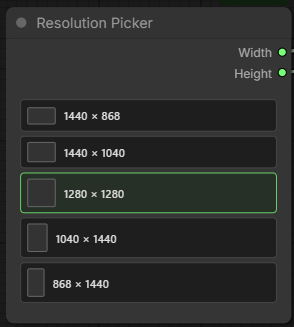

# CrasH Utils Custom Nodes

A collection of utility nodes and games for ComfyUI — visual LoRA loaders, image tools, SDXL helpers, LLM integration, and browser games for long generation queues.

---

## Table of contents

- [Node index](#node-index)
- [Installation](#installation)
- [Loaders](#loaders)
  - [Grid LoRA Loader](#grid-lora-loader)
  - [List LoRA Loader](#list-lora-loader)
  - [Checkpoint Names](#checkpoint-names)
- [Image](#image)
  - [Resolution Picker](#resolution-picker)
  - [SDXL Resolution](#sdxl-resolution)
  - [SDXL Resolution To Dimensions](#sdxl-resolution-to-dimensions)
- [Effects](#effects)
  - [Image Glitcher](#image-glitcher)
  - [Color Stylizer](#color-stylizer)
- [LLM](#llm)
  - [Query Local LLM](#query-local-llm)
  - [Extract Character Info](#extract-character-info)
- [Games](#games)
- [Issues & contributions](#issues--contributions)
- [Credits](#credits)
- [License](#license)

---

## Node index

All nodes appear under the **CrasH Utils** menu in ComfyUI, grouped by subcategory:

| Node | Category | What it does |
|------|----------|--------------|
| **Grid LoRA Loader** | Loaders | Multi-LoRA picker with thumbnail grid, trigger tags panel, and strength controls |
| **List LoRA Loader** | Loaders | Same LoRA features in a compact vertical list layout |
| **Checkpoint Names** | Loaders | Outputs the selected checkpoint name as a string |
| **Resolution Picker** | Image | Visual picker for five common resolutions → width & height |
| **SDXL Resolution** | Image | Dropdown of every SDXL-trained resolution |
| **SDXL Resolution To Dimensions** | Image | Splits SDXL Resolution into separate width & height outputs |
| **Image Glitcher** | Effects | Glitch art with chromatic aberration and scanlines |
| **Color Stylizer** | Effects | Keep one color, desaturate everything else |
| **Query Local LLM** | LLM | Send prompts to OpenAI-compatible APIs (local or cloud) |
| **Extract Character Info** | LLM | Read embedded character metadata from a PNG file path |
| **Snake Game** 🐍 | Games | Classic Nokia-style snake |
| **Tetris** 🟦 | Games | Block-stacking puzzle |
| **Dino Game** 🦖 | Games | Chrome-style endless runner |
| **Space Invaders** 👾 | Games | Arcade shooter |
| **DOOM** 👹 | Games | Full DOOM Shareware in the browser |

---

## Installation

**Recommended:** install via ComfyUI Manager — search for **CrasH Utils**.

**Manual:**

```bash
cd ComfyUI/custom_nodes/
git clone https://github.com/chrish-slingshot/CrasHUtils.git
```

Restart ComfyUI. No extra dependencies — everything runs out of the box.

---

## Loaders

### Grid LoRA Loader

Visual multi-LoRA loader with a thumbnail grid browser, selected-LoRA panel, and per-tag trigger output. Inspired by rgthree's LoRA tooling.



**Outputs:** `MODEL`, `CLIP`, `triggers`

| Panel | Actions |
|-------|---------|
| **Browse** | Navigate folders, search, SFW toggle, double-click to add/remove LoRAs, right-click for info |
| **Selected** | Single-click enable/disable, double-click remove, ⚙ for strength |
| **Trigger Tags** | Toggle which tags are sent to the `triggers` output |

**Thumbnails:** place `{lora_name}.png` next to each `.safetensors` file. Right-click a **Preview Image** → **Save as LoRA thumbnail** to save from a generated image (overwrites existing).

**Trigger words:** companion `.txt` file beside the LoRA (same base name). One per line or comma-separated.

**Panels:** drag dividers between Browse / Selected / Tags to resize. Settings persist per node.

**Typical workflow:**
1. Connect `model` and `clip`
2. Browse and double-click LoRAs to add them
3. Tune strength with ⚙; disable any you want to keep but not apply
4. Toggle trigger tags for your prompt
5. Connect `MODEL`, `CLIP`, and `triggers` downstream

---

### List LoRA Loader

Same backend and outputs as the grid loader, in a vertical list layout. Better when you want names and trigger tags readable at a glance rather than a thumbnail wall.



**Browse:** folder navigation, search, SFW toggle, double-click add/remove, right-click info. Trigger tags appear inline on each row.

**Selected:** same enable/disable, strength, and remove controls as the grid loader.

Everything else — thumbnails, `.txt` triggers, Preview Image save, `MODEL` / `CLIP` / `triggers` outputs — works the same as [Grid LoRA Loader](#grid-lora-loader).

---

### Checkpoint Names

Pass-through node that outputs the selected checkpoint filename as a **STRING**. Useful when a workflow needs the checkpoint name as text (logging, filenames, LLM prompts, etc.).

---

## Image

### Resolution Picker

Click a resolution to output **Width** and **Height** integers. Each option shows a small aspect-ratio preview.



| Resolution | Orientation |
|------------|-------------|
| 1440 × 868 | Landscape |
| 1440 × 1040 | Landscape |
| 1280 × 1280 | Square |
| 1040 × 1440 | Portrait |
| 868 × 1440 | Portrait |

Connect outputs to Empty Latent Image or anywhere you need dimensions. For the **full** list of SDXL-trained sizes, use [SDXL Resolution](#sdxl-resolution) instead.

---

### SDXL Resolution

Dropdown of **all** official SDXL-trained resolutions (1024×1024, 1152×896, 1216×832, etc.) with aspect ratio labels. SDXL gives best results at these specific sizes.

 

---

### SDXL Resolution To Dimensions

Splits the SDXL Resolution string into separate **width** and **height** outputs — one connection instead of two downstream.


---

## Effects

### Image Glitcher

Authentic glitch art with chromatic aberration and CRT scanlines. Based on the HTML image glitcher by [Felix Turner](https://www.airtightinteractive.com/demos/js/imageglitcher/).


| Parameter | Range | Effect |
|-----------|-------|--------|
| **glitchiness** | 0–100 | Corruption and chromatic aberration intensity |
| **brightness** | 0–100 | Brightens the image; useful with scanlines |
| **scanlines** | toggle | CRT TV scanlines |


---

### Color Stylizer

Pick one color to preserve; everything else is desaturated. Good for *Sin City* / *Schindler's List* style isolation.

 

| Parameter | Effect |
|-----------|--------|
| **target_color** | Color to keep (hex or RGB) |
| **tolerance** | How closely colors must match |
| **desaturation** | How much to grey out non-matching areas |

---

## LLM

### Query Local LLM

Send prompts to any OpenAI-compatible API and get text back in your workflow — prompt expansion, descriptions, or general text tasks.


Works with OpenAI, LM Studio, Ollama, text-generation-webui, and other compatible endpoints. Configure URL, system message, context length, and seed.

---

### Extract Character Info

Reads embedded character metadata from a PNG file path (base64-encoded text chunks) and outputs it as a string. Useful for workflows that store character data inside generated images.

---

## Games

Browser games that run inside ComfyUI nodes — no installs, no external deps. Handy while waiting on long generations.

**Controls (all games):**
- **Click the game canvas** to capture keyboard input
- **Click outside the node** to release it

---

### 🐍 Snake Game

Classic Nokia-style snake. Arrow keys or WASD; Space to pause/restart.


---

### 🧱 Tetris

Arrow Left/Right move, Down soft drop, Up rotate, Space hard drop. Score, levels, next-piece preview.

---

### 🦖 Dino Game

Chrome offline runner. Space or Up to jump. Increasing difficulty and high score.

---

### 👾 Space Invaders

Arrow keys move, Space shoots. Wave-based arcade action.

---

### 🔫 DOOM

Full DOOM Shareware v1.9 in the browser via js-dos.

**Automatic setup (recommended):** add the node — it downloads ~2MB on first run from several mirrors, then launches.

**Manual setup** (if auto-download fails):
1. Download DOOM Shareware v1.9 from [Doomworld](https://www.doomworld.com/idgames/idstuff/doom/win95/doom19s) or [Archive.org](https://archive.org/details/DoomsharewareEpisode)
2. Place `DOOM.EXE` and `DOOM1.WAD` in `ComfyUI/custom_nodes/CrasHUtils/doom/`
3. Restart ComfyUI

**Troubleshooting:** click outside the node if keyboard sticks; check the browser console if download fails.

---

## Issues & contributions

Found a bug or want a feature? [Open an issue](https://github.com/chrish-slingshot/CrasHUtils/issues) on GitHub.

Pull requests welcome — especially new games or utility nodes.

---

## Credits

- **Image Glitcher** — [Felix Turner](https://www.airtightinteractive.com/demos/js/imageglitcher/)
- **LoRA loaders** — UI inspired by rgthree's LoRA tooling
- **DOOM** — [js-dos](https://js-dos.com/) emulator; Shareware © id Software

---

## License

MIT License — use, modify, and distribute freely.

DOOM Shareware is distributed under id Software's original shareware license.
